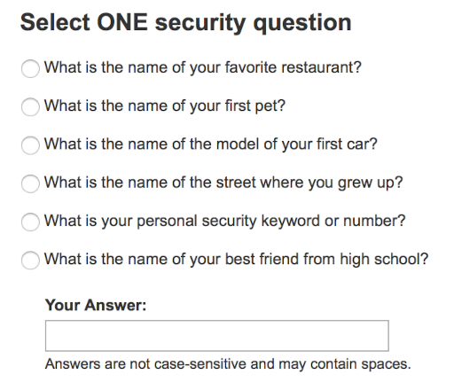

Sometimes developers limit the choices that are offered to their users as a <a title="6 Strategies to Simplify Software" href="6-strategies-to-simplify-software">way to simplify</a>. This can be a good thing; I’m a big fan of <a href="the-power-of-simplicity">simplicity</a>.

However, this strategy comes with an important caveat:

If you're going to force all choices into a few predefined buckets, you better provide buckets that <a href="why-mental-models-matter">match the needs</a> of your <a href="why-people-are-part-of-a-software-architecture" title="Why People Are Part of A Software Architecture">users</a>.

Broken buckets will not earn you brownie points. Or revenue.

<figure><figcaption>image credit: Midjourney</figcaption></figure>

Today I was adjusting my 401k contribution. Here's the broken buckets I saw when I logged in to the financial services website:

See, here's the problem. I have 3 favorite restaurants ("<em>what's your favorite ___?</em>" security questions are <em>all</em> useless to me), I'm not a pet person, I don't remember what kind of car I first drove, I lived in 20 different places by the time I was 18, I didn't have just one best friend in high school, and I don't have a security keyword that I reuse.

None of these buckets works. But I had to choose one, and I couldn't log in to the web site (even to send a note about my dissatisfaction to customer service) until I did.

I have a similar beef about parental controls on Netflix. Last time I checked, there was a slider that gave you 3 positions: no controls, "older teen", and "kid". So what if I've got a teen who's not interested in <em>Sesame Street</em> and <em>My Little Pony</em>, but who has childhood trauma as an orphan in a third-world country, and who thus needs to not be offered certain movies in the "older teen" category? What if I'm sick of the promo images for raunchy R-rated movies, but I want to watch an occasional PG-13 thriller? What if I want to watch a show which is unrated (and therefore available only the most wide-open adult setting), but I can't risk leaving Netflix in wide-open mode all the time (since a kid profile can switch to its parent profile without a password)? I could solve this bucket problem if Netflix gave me a whitelist and/or blacklist feature &mdash; but apparently the all-wise, childless 20-somethings who wrote the parental control features at Netflix thought three buckets was plenty. What could <a href="lynn-bendixsen-listen" title="Lynn Bendixsen: Listen." target="_blank">listening</a> teach them?

<h3>The true sin</h3>

I'm grumbling about my choice of buckets, but in the end, it's not the bucket menu, in and of itself, that bugs me. Like I said above, I get why developers might need to simplify. You <a href="flexibility-is-no-virtue" title="Flexibility is No Virtue" target="_blank">can't please everyone</a>.

No. What <em>really</em> bugs me is that software with poorly chosen buckets also tends to be software that &mdash; either by <a href="users-arent-the-only-people-in-your-software" title="Users Aren’t The Only People In Your Software">humans they serve</a>. And I dare you to find any way for a Netflix customer to contact the dev team or product manager that owns parental controls. I tried and failed.

Seth Godin recently blogged about how <a href="http://sethgodin.typepad.com/seths_blog/2015/03/what-is-customer-service-for.html" target="_blank">different corporate cultures approach customer interactions differently</a> &mdash; and why that makes a world of difference. He was nice and non-controversial; he didn't take a strong position on whether certain approaches are unethical.

I'm going to be less diplomatic. As the <a href="http://trevharmon.com/standard-of-business/">Conscious Business Ethics Manifesto</a> says, we have a duty to provide real value to those who pay us for our goods and services&mdash;not merely to provide a glitzy facade. If we’re going to force users into buckets, let’s give some <a href="role-play-centered-design">careful thought to the buckets we offer</a>&mdash;and let’s make sure we have a way of discovering and <a href="bridging-the-lacuna-humana" title="Thoughts On Bridging the “Lacuna Humana”">tracking</a> whether our buckets are useful.
