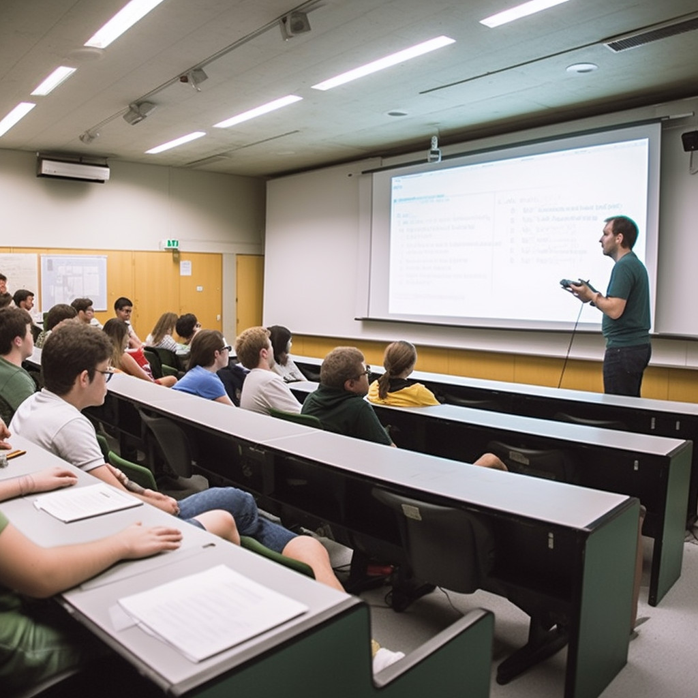

I'm glad newly minted software engineers are exposed to data structures, compilers, concurrency, graph theory, assembly language, and the other goodies that constitute a computer science curriculum. All that stuff is important.

But it's not enough.

<figure><figcaption>Not all classroom material for CS folks should be technical. Image credit: Midjourney.</figcaption></figure>

Since I'm half way to curmudgeon-hood, I frequently find myself lamenting educational blindspots in the young. I've even toyed with the idea of teaching at the nearest university, some day when I Have More Time™. If academia would take me, my lesson plans might cover some of the following topics:
<ul>
	<li>How to work with smart but misaligned teammates, manage opinioand personalities, and contribute to a cohesive team. (Software development is a <em>team</em> sport, young padawan.)</li>
	<li>The power of metaphor in software design. (See <a title="Good Code Is Named Right" href="good-code-is-named-right.md">this post</a>.)</li>
	<li><a title="Why Exceptions Aren’t Enough" href="why-exceptions-arent-enough.md">Choosing a good error raising and error handling strategy</a>. (Assignment: find half a dozen error messages in open source projects, and rewrite them to make them intelligible to the Average Human.)</li>
	<li>The art of <a title="Good Code Is Balanced" href="good-code-is-balanced.md">tradeoffs</a>. (Usually, there ain't no such thing as a free lunch.)</li>
	<li><a title="Coping With Organizational Alzheimers" href="coping-with-organizational-alzheimers.md">Managing technical debt</a>.</li>
	<li>Using version control, especially somewhat diverged branches.</li>
	<li>Communicating effectively with remote collaborators, including those whose native language is not your own.</li>
	<li>Data- and <a title="Good Code Is Optimized" href="good-code-is-optimized.md">user-driven optimization</a>. (Required reading: <em><a class="zem_slink" title="The Goal: A Process of Ongoing Improvement" href="http://www.amazon.com/Goal-Process-Ongoing-Improvement/dp/0884271781%3FSubscriptionId%3D0G81C5DAZ03ZR9WH9X82%26tag%3Dzemanta-20%26linkCode%3Dxm2%26camp%3D2025%26creative%3D165953%26creativeASIN%3D0884271781" target="_blank" rel="amazon">The Goal</a></em>, by Eliyahu M. Goldratt).</li>
	<li>Understanding and speaking the language of business.</li>
	<li><a title="Six Learning Tips For Tech Folks" href="six-learning-tips-for-tech-folks.md">Learning how to learn</a>, to keep up with the industry after you leave school.</li>
	<li>Estimating wisely.</li>
	<li>Finding the non-obvious human and process levers in an organization to get things done.</li>
	<li><a title="// Comments on Comments" href="comments-on-comments.md">Effective commenting</a>.</li>
	<li>Coding for maintainability.</li>
	<li>Great role models in software development.</li>
	<li>Common newbie and journeyman mistakes.</li>
	<li>A running contest where any student is invited to stump the rest of the class to find some problem that doesn't already have at least one useful open-source library you could use as a starting point. (Newton: "I have stood on the shoulders of giants.")</li>
</ul>
This is only the beginning of my lesson topics; I'm sure I could come up with dozens more, if I thought for a while.

What would you add to the list?<strong> <em>Please comment. And please subscribe to my blog (top of right sidebar) for explorations of these topics.</em></strong>
