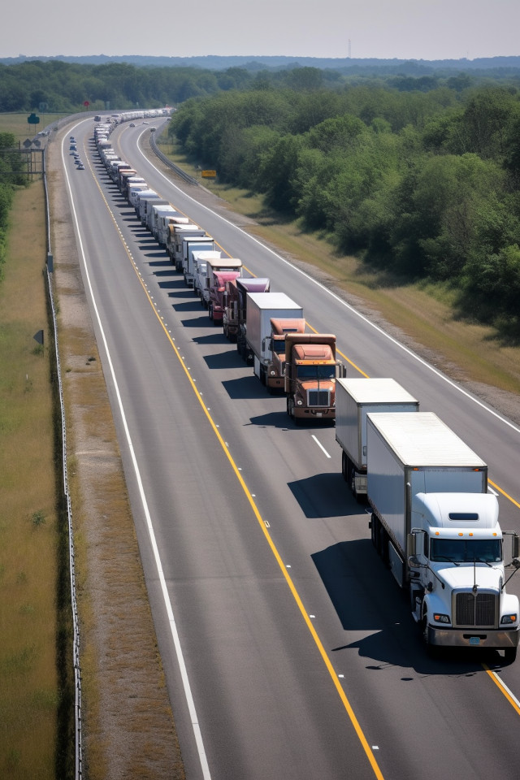

It occurred to me this past week that convoys &mdash; especially the kind where truckers form and manage ad hoc communities through chatter on CB radio &mdash; are an excellent model for the sort of distributed software architecture that cloud-native software demands. In part 2 of my <a title="cloudify series" href="../../../category/cloudify">series of posts about how to "cloudify"</a> your code and designs on <a title="Adaptive Computing" href="http://www.adaptivecomputing.com" target="_blank">Adaptive Computing's website</a>, I discuss the lessons that programmers ought to absorb from their role models in big rigs. Head over there and <a title="cloudify with CB radio" href="http://www.adaptivecomputing.com/blog-cloud/how-to-cloudify-your-software-part-2-get-out-your-cb/" target="_blank">check it out</a>.

<figure><figcaption>Convoys require frequent, real-time, adaptive coordination by many independent actors. Image credit: Midjourney</figcaption></figure>

Stay tuned for further installments of <a title="Cloudify software designs" href="programmers-learn-how-to-cloudify.md">Part 1</a>, I believe that a competence with cloud &mdash; cloud-oriented programming, if you will &mdash; will be a checkbox on future tech resumes.