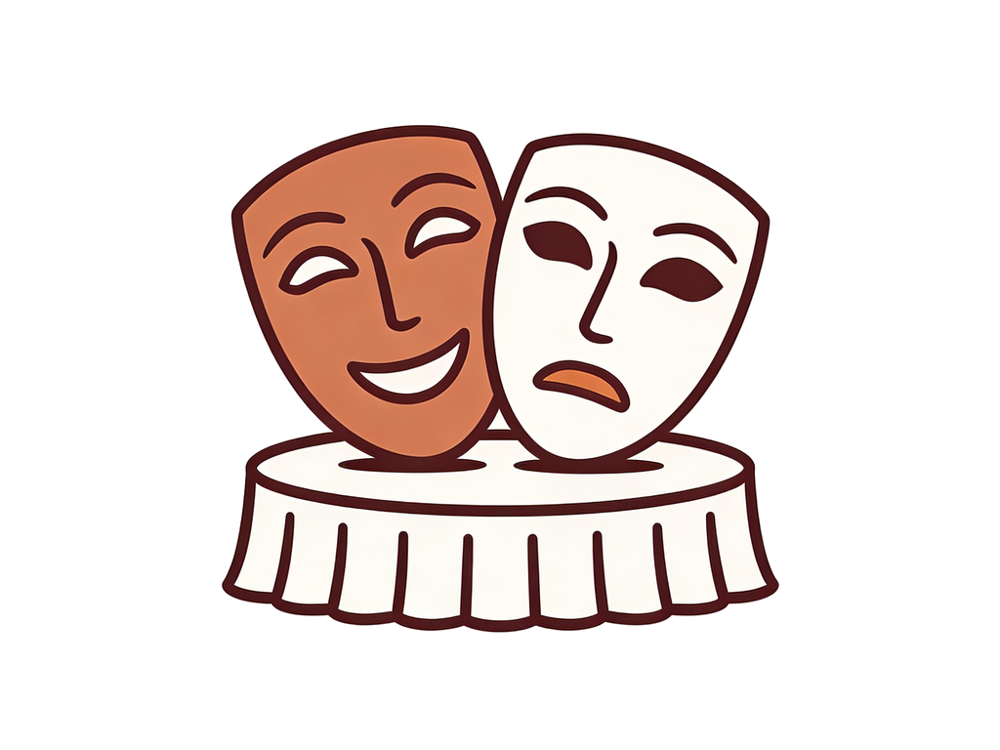

User-centered design (UCD) is important. I hope I've been a good advocate for it during my career. Its basic tenet is that software should be constructed as much as possible according to how users think and work, not according to techie considerations. (A seminal book on this topic is <a href="http://www.amazon.com/dp/0465067107/ref=rdr_ext_tmb">The Design of Everyday Things</a>, by Donald Norman.) At its best, UCD promotes an alignment between technology and customer pain points that keeps software's value proposition compelling. Even on a bad day, UCD makes software a lot more pleasant to use.

However, UCD rarely yields all potential benefits, which is why I'd like to suggest a specialized form of UCD for many software teams. I'll dub this idea "Role-Play Centered Design" (RPCD, prounounced /ˈrɪpˌsɪd/) because of the way the various parts of the system come to life. (This idea is similar to &mdash; though conceived independently from &mdash; the concepts in <a title="The use of improvisational role-play in user centered design processes" href="http://dl.acm.org/citation.cfm?id=1772520" target="_blank">this article</a> from the proceedings of HCI '07.)

<figure><figcaption>Role plays can help you build software &mdash; not just entertain.</figcaption></figure>

## Manifesto

RPCD is distinguished from ordinary UCD by three key tenets.
<ol>
	<li>The "system" includes people.</li>
	<li>Specifics are non-negotiable.</li>
	<li>The best way to understand is to "be" the system.</li>
</ol>
Let me justify each of these ideas, and then I'll give an example of an RPCD process at work.

## The "system" includes people.

Most architectural and UML diagrams focus on software and/or hardware entities. The user's role in the system is implicit. Even among users of <a href="http://en.wikipedia.org/wiki/Activity_diagram">activity diagrams</a>, most workflow is computer rather than human.

This is wrong. <a href="why-people-are-part-of-a-software-architecture.md">software - people != software</a>. Any thoughtful veteran of the industry can tell you stories about why this is so. Engineers who accept the flawed premise that only the computer side of software needs to be designed are already handicapping their UCD fatally. The system built by a software team includes people &mdash; individual users, a community, support personnel, sales folks, professional services, maintainers of docs on a web site, etc. If you let an engineer construct "the system" with no serious thought to the people, you often end up with misalignments that make it irritating to understand/use/configure/support, expensive to maintain, or even impossible to sell.

## Specifics are non-negotiable.

The devil really is in the details, and ifu don't solve detailed problems, you won't solve problems at all. The design of a system is therefore best driven by specifics &mdash; even if the specifics are only postulated. Specifics are best exemplified by use cases, and role playing forces specifics into use cases.

## The best way to understand is to "be" the system.

<a href="what-role-are-you-playing-in-rpcd.md">You should "be" the software in the system, and you should "be" the people as well</a>.

When a hu being actually interviews someone in the same way an automated wizard eventually will, you learn things. The human reorders the questions or short-circuits part of the interview because she knows it's unnecessary. Or the human gets frustrated at how needlessly cumbersome a particular part of the process is. Or the human asks some intelligent questions that you never considered. When two humans interact to model what's eventually going to be a formal protocol, you confront asynchronicity and error handling in ways that UML or whiteboards don't.

Modeling the system in role plays also has some other profound long-term advantages that go far beyond just what you learn. I'll discuss these in a different post.

In my <a href="example-rpcd-interaction.md">next post</a>, I'll give an example about how RPCD works.

<strong>Action Item</strong>

<em>List all the people that interact with or help create your software. If your list has less than four or five unique roles, think some more. Hint: see <a title="Users Aren’t The Only People In Your Software" href="users-arent-the-only-people-in-your-software.md">this post</a>.</em>

